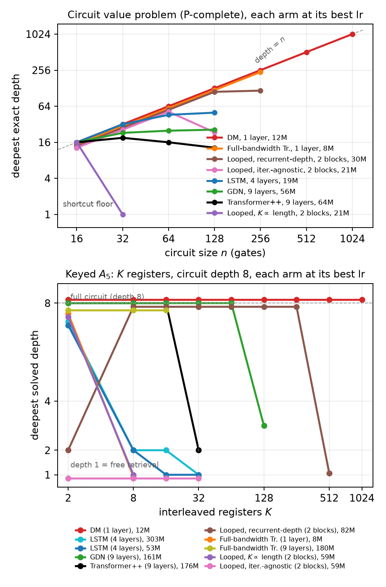
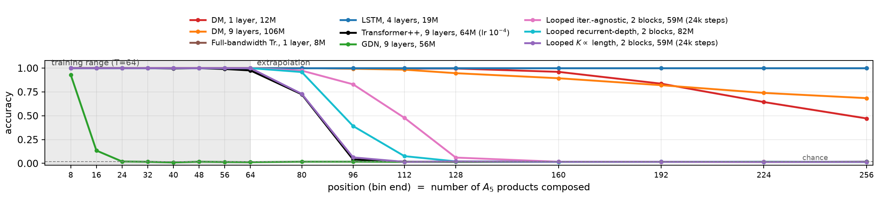

# Dual-Mod Attention

Code release for **Dual-Mod Attention: Recurrent Cache as an Exact Superset of the Transformer**.

Dual-Mod (DM) attention keeps the append-only KV tape of a Transformer but writes each new key/value
*recurrently from the tape* instead of from the raw token: the write at position *t* attends over the entries
written before it and modulates its own key and value with what it read. The recurrence is causal and
nilpotent, so the state moves at every token and never reaches a fixed point; with the modulation gates
closed the layer is exactly a Transformer layer. Because autoregressive decoding is already sequential, the
recurrence adds nothing to per-token decode cost. Training is chunk-parallel: within a chunk of *c* tokens the
recurrence is solved by *K* Jacobi sweeps (exact once *K = c*), and chunks are chained Gauss-Seidel style.

<p align="center"> </p>

**Left:** the two axes where a fixed-depth Transformer, a fixed-size recurrence and a looped Transformer each
drop out. Top: circuit value problem (P-complete), deepest exactly-solved depth against circuit size; a
one-layer 12M DM is exact at every depth to 1024 gates. Bottom: keyed A5 (K interleaved A5 registers at depth
8); the same one-layer DM holds every register to K=1024. **Right:** the A5 word problem at T=64, accuracy by
position when evaluated to 4x the training length.

## What is in the repository

| path | contents |
|---|---|
| `models/dualmod/` | the DM model: `config.py` (every knob), `attention.py` (the per-position `attend_one` / `refine_kv` step shared by training scan and decode), `scan.py` (exact sequential scan, the oracle every engine is tested against), `model.py` (LLaMA-style trunk: RMSNorm, RoPE, SwiGLU, tied embeddings), `data.py` (packed-token loader) |
| `models/fbt/` | full-bandwidth Transformer (Wang et al.), exact sequential training and the paper's multi-pass approximation |
| `models/looped/` | looped Transformer: iteration-agnostic (input injection + step embedding, K ~ U[K/4, K]) and K-proportional-to-length (Fan et al.) regimes |
| `models/recurrent_depth/` | the recurrent-depth recipe of Geiping et al. (prelude, noise state, adapter on [s; e], sandwich norms, coda, log-normal iteration counts, truncated backprop, sqrt(d) embedding scale) |
| `models/baselines/` | LSTM and Gated DeltaNet baselines; Transformer++ is `DualModLM` with the modulation disabled |
| `engines/wavescan/` | the 340M training engine (H100 runs): chunked Jacobi cells, fused Triton sweep kernels, CUDA-graph capture, reverse-scan backward with exact recompute, DDP-ready flat gradient buffers; `tests/` = exactness suite against the sequential scan |
| `engines/wave3d/` | the 1.3B training engine (B300 runs): layer-batched 3D wavefront (layer *l* runs intra-step *t - lK*), time-major write-once caches, windowed attention kernels (Flash / cuDNN-frontend / math), fused refine chain, per-K CUDA graphs |
| `lm/data/` | SlimPajama-627B pretokenization (340M) and FineWeb-Edu 100BT pretokenization (1.3B) |
| `lm/train_340m/` | 340M / 15B-token SlimPajama training: DM flagship and the Transformer++ / GDN baselines, with launch scripts |
| `lm/train_1p3b/` | 1.3B / 100B-token FineWeb-Edu training (the GDN-2 recipe), K-ladder scheduler, storm governor, launch scripts, the exactness validator |
| `lm/eval/` | lm-eval-harness adapter for DM checkpoints (likelihood through the exact scan or the engine, generation through incremental decode), the Based / JRT recall tasks, held-out CE, MQAR, RULER NIAH via lm-eval (340M) and via NVIDIA's official generator (1.3B), the post-training battery |
| `formal_language/` | the formal-language harness (`harness/`), one folder per experiment with reproduction scripts: `a5/`, `keyed_a5/`, `cvp/`, `length_gen/`, `loop_fixed_point/` |
| `tinystories/` | the 63M TinyStories k-mod / v-mod ablation (exact eager scan, 2-GPU DDP) |
| `figures/` | every figure of the paper, the renderers, and the curated inputs they read (`figures/data/`, 350 KB) |
| `docs/` | analysis notes shipped as documentation: FBT recipe and cost analysis, loop fixed-point numbers, TinyStories setup, GDN-2 comparison protocol |
| `tests/` | model-level equivalence tests (scan = vanilla with gates closed, decode = teacher forcing, causality, checkpointing) |

## Installation

```bash
git clone https://github.com/Atom-101/dual_mod_public && cd dual_mod_public
python -m venv .venv && source .venv/bin/activate
pip install -r requirements.txt            # torch 2.12.1 + triton 3.7.1 (CUDA 13), lm-eval 0.4.12, ...
export PYTHONPATH=$PWD                     # every script is run from the repository root
pytest -q                                  # model + engine exactness tests, ~6 min on one GPU
```

The two engines need a CUDA GPU; the fused sweep kernels use `triton.language.extra.libdevice`, so the
Triton version is pinned. The 1.3B wave3d engine additionally uses the cuDNN frontend SDPA kernels on
Blackwell (`pip install nvidia-cudnn-frontend==1.28.0`; the Flash and math kernels are the fallback). If a
system cuDNN is on `LD_LIBRARY_PATH` it can shadow the one bundled with torch; the launch scripts unset it.

**Gated DeltaNet arms** (`--arch gdn` in the formal-language harness, `lm/train_340m/scripts/launch_gdn.sh`)
need `flash-linear-attention==0.5.1`, which wants `transformers==4.57.1` and `tilelang` on Hopper. Install the
`gdn` extra of `pyproject.toml` in a second environment and pass its interpreter as `PY_GDN=...`. The 1.3B
GDN-2 comparison uses the third-party checkpoint and the official `lit_gpt` code (`lm/eval/gdn2lit_shim.py`),
not a re-implementation.

## Quick start

```bash
# 1. the model, eagerly (exact sequential scan), on a tiny formal-language task: A5 at T=16, 30 steps
python formal_language/harness/train_statetrack.py --task group --group a5 --format tagged --n_ops 16 \
    --arch dualmod --ctx_mod mult_res --n_layers 1 --scale 5m --steps 30 --bsz 16 --lr 4e-4

# 2. the 340M engine end to end, 30 steps on one GPU (needs data/slimpj627_train.bin, see lm/data/)
SMOKE=1 GPUS=0 bash lm/train_340m/scripts/launch_dm_d960.sh

# 3. the 1.3B engine, 40 steps on one node (needs data/fwedu_100b/, see lm/data/)
GPUS=0,1,2,3,4,5,6,7 GLOBAL_BATCH=8 TOTAL_STEPS=40 bash lm/train_1p3b/smoke_local.sh
```

## Reproducing the paper

All commands run from the repository root with `PYTHONPATH=$PWD`. Seeds, learning rates, widths and step
budgets in the scripts are the ones behind the reported numbers; where a table cell came from a sweep the
script comments say which seeds were run.

### Formal languages (`formal_language/`)

| experiment | script | what it reproduces |
|---|---|---|
| A5 word problem, T=64, extrapolation to 4x | `a5/run_a5_T64.sh <arm>` | Table "a5" (left), Fig. "a5pos": DM 1L/9L, Transformer++, GDN, LSTM, FBT, three loop recipes |
| A5 minimum layers at T in {5,10,15,20} | `a5/run_a5_minlayers.sh grid` | Table "a5" (right) |
| A5 length x depth heat map | `a5/run_a5_depth_heatmap.sh` | Fig. "a5depth" |
| keyed A5, cold cells and register ramps | `keyed_a5/run_keyed.sh <mode>`; `keyed_a5/run_dm_lineage.sh` | Table "keyed_cvp" (left) |
| circuit value problem, cold cells and n -> 2n chains | `cvp/run_cvp.sh <mode>`; `cvp/run_dm_lineage.sh` | Table "keyed_cvp" (right), Fig. "cvpdepth", Fig. "cvpminlayers" |
| C-RASP length generalization, 7 languages | `length_gen/run_lengthgen.sh <arm> <language>` | Table "lengthgen", Fig. "lengthgen" |
| looped-Transformer positive control (running parity) | `length_gen/run_parity_control.sh` | appendix control |
| loop fixed points, in- and out-of-distribution | `loop_fixed_point/run_fixed_points.sh <ckpt> <task>` | Fig. "fixedpoints", Tables "loopstate" / "loopdeepest" |

Every run prints one `FINAL` line (in-distribution accuracy, per-position or per-depth bins, extrapolation
factors) and writes `analysis/statetrack_<tag>_<arch>.json`; `--eval_dump` also saves the checkpoint to
`out/statetrack_ckpts/`. DM cells with sequences longer than a few hundred tokens use the WaveScan-engine
harness `train_statetrack_ws.py` (the eager scan is 5-10x slower there); every baseline runs eagerly.

### Language modeling

**340M, SlimPajama, 15.36B tokens** (`lm/train_340m/`, 8 GPUs, ~40 h per arm on H100):

```bash
HF_TOKEN=... python lm/data/pretokenize_slimpj627.py --target_tokens 15.5e9 --workers 96   # Mistral-32k tokenizer
bash lm/train_340m/scripts/launch_dm_d960.sh              # DM d=960 x 26, rank-120 factors, mult-res write operator
NOKMOD=1 bash lm/train_340m/scripts/launch_dm_d960.sh     # k-mod ablation arm
GPUS=6,7 bash lm/train_340m/scripts/launch_tpp.sh         # Transformer++ d=1024 x 24
bash lm/train_340m/scripts/launch_gdn.sh                  # Gated DeltaNet (fla environment)
bash lm/eval/run_posttrain_suite.sh out/PDN-DM-d960-mrk-lora8-sync-s42/ckpt_latest.pt 0,1,2,3,4,5 dm   # 12 eval jobs
CKPT=out/PDN-DM-d960-mrk-lora8-sync-s42/ckpt_latest.pt GPUS=0,1,2,3 bash lm/eval/niah_340m.sh          # RULER NIAH, 500/cell
```

**1.3B, FineWeb-Edu, 100B tokens** (`lm/train_1p3b/`, 4 nodes x 8 GPUs, the GDN-2 recipe: 0.5M-token batches,
190,650 steps, lr 4e-4 cosine, 2K sliding window, K-ladder 8 -> 16 -> 24 with one-rung-up probes, c = 64):

```bash
python lm/data/tokenize_fwedu.py tokenize --file_lo 0 --file_hi 140 --workers 180 && python lm/data/tokenize_fwedu.py merge --budget_gb 100
NODES="host0 host1 host2 host3" bash lm/train_1p3b/launch_swa2k.sh                 # ssh fan-out of launch_hero_wave3d.sh
NODES="host0 host1 host2 host3" CKPT=out/hero-fw-1p3b-swa2k-s1337/ckpt_latest.pt PHASES="tf_k24 siqa_k24" bash lm/eval/gdn2_evals_dist.sh
NODES="host0 host1 host2 host3" CKPT=out/hero-fw-1p3b-swa2k-s1337/ckpt_latest.pt PHASES="gen_rc_jrt" bash lm/eval/gdn2_evals_gen.sh
NODES="host0 host1" bash lm/eval/ruler/ruler_official_chain.sh                      # NVIDIA RULER generator + scoring
python lm/eval/gdn2_collate.py hero-fw-1p3b-swa2k-s1337
python lm/train_1p3b/validate_rawdiag.py --T 8192 --B 1 --L 2                        # engine at K = c vs the exact scan
```

**TinyStories ablation** (`tinystories/`): `python -m models.dualmod.data --data_dir data`, then
`ARM=A|E|B|C|D GPUS=0,1 bash tinystories/run_ablation.sh`.

### Figures

`python figures/render/<name>.py` regenerates each paper figure from `figures/data/` (the FINAL lines and
result JSONs of the runs it plots; the two headline renderers carry their numbers inline). The shipped PNGs
were regenerated from this directory and are pixel-identical to the paper's.

## Results

Numbers below are the paper's, with the corrections found after submission applied (marked *).

**Circuit value problem** (accuracy, deepest exact depth in parentheses; exact = accuracy >= 0.95 at every depth):

| model | params | n=16 | 32 | 64 | 128 | 256 | 512 | 1024 |
|---|---|---|---|---|---|---|---|---|
| Transformer++ (9L) | 64M | 1.00 (16) | 0.90 (19) | 0.70 (16) | 0.62 (13) | | | |
| Looped, K proportional to length | 21M | 1.00 (16) | 0.57 (0) | 0.56 (0) | | | | |
| Looped, iteration-agnostic | 21M | 1.00 (16) | 1.00 (32) | 1.00 (64) | 0.72 (29) | | | |
| Looped, recurrent-depth (2 blocks)* | 30M | 1.00 (16) | 1.00 (32) | 1.00 (64) | 1.00 (128) | 0.82 (134) | | |
| GDN (9L) | 56M | 1.00 (16) | 0.93 (23) | 0.77 (25) | 0.66 (26) | | | |
| LSTM (4L) | 19M | 1.00 (16) | 1.00 (32) | 0.92 (46) | 0.75 (50) | | | |
| Full-bandwidth Tr. (1L)* | 8M | 1.00 (16) | 1.00 (32) | 1.00 (64) | 1.00 (128) | 1.00 (256) | 0.85 (333) | floor |
| **DM (1L)** | 12M | 1.00 (16) | 1.00 (32) | 1.00 (64) | 1.00 (128) | 1.00 (256) | 1.00 (512) | 1.00 (1024) |

**Keyed A5** (deepest solved depth at D=8 for K registers; depth 1 is free retrieval):

| model | params | K=2 | 8 | 16 | 32 | 64 | 128 | 256 | 512 | 1024 |
|---|---|---|---|---|---|---|---|---|---|---|
| Transformer++ (9L) | 176M | 8 | 8 | 8 | 2 | | | | | |
| GDN (9L) | 161M | 8 | 8 | 8 | 8 | 8 | 3 | | | |
| LSTM (4L) | 53M / 303M | 8 | 2 | 1 / 2 | 1 | | | | | |
| Looped, iteration-agnostic (2 blocks) | 59M | 1 | 1 | | | | | | | |
| Looped, K proportional to length (2 blocks) | 59M | 8 | 1 | | | | | | | |
| Looped, recurrent-depth, 2 blocks* | 82M | 2 | 8 | 8 | 8 | 8 | 8 | 8 | 7 | 7 |
| Looped, recurrent-depth, 1 block* | 62M | | 8 | 8 | 8 | 8 | 8 | 8 | 8 | 8 |
| Full-bandwidth Tr. (1L) | 8M | 8 | 1 | | | | | | | |
| Full-bandwidth Tr. (9L)* | 180M | 8 | 8 | 8 | 8 | 8 (0.988) | | | | |
| **DM (1L)** | 12M | 8 | 8 | 8 | 8 | 8 | 8 | 8 | 8 | 8 |

**A5 word problem at T=64** (in-distribution / 2x / 4x):

| model | params | in-dist. | 2x | 4x |
|---|---|---|---|---|
| Transformer++ (9L) | 64M | 0.995 | 0.597 | 0.308 |
| GDN (9L) | 56M | 0.145 | 0.084 | 0.049 |
| LSTM (4L) | 19M | 1.000 | 1.000 | 1.000 |
| Looped, iteration-agnostic | 59M | 1.000 | 0.793 | 0.404 |
| Looped, K proportional to length | 59M | 1.000 | 0.604 | 0.308 |
| Looped, recurrent-depth* | 82M | 1.000 | 0.79-0.81 | 0.41 |
| Full-bandwidth Tr. (1L) | 8M | 1.000 | 1.000 | 1.000 |
| **DM (1L)** | 12M | 1.000 | 0.95-1.00 | 0.56-0.86 |
| **DM (9L)** | 106M | 1.000 | 0.96-0.99 | 0.65-0.89 |

**Language modeling, 340M / 15B SlimPajama tokens** (shared token stream, Mistral-32k tokenizer):

| model | non-emb. params | val CE | test CE | Wiki ppl | LMB ppl | Avg6 acc | Avg8 acc | MQAR avg | Based recall avg3 | JRT recall avg6 |
|---|---|---|---|---|---|---|---|---|---|---|
| Transformer++ | 303.6M | 2.4816 | 2.5358 | 26.99 | 36.21 | 42.37 | 49.17 | 22.46 | 26.77 | 32.89 |
| GDN | 334.0M | 2.4672 | 2.5217 | 26.57 | 29.51 | 42.92 | 49.39 | 34.64 | 25.06 | 25.87 |
| **DM** | 329.6M | **2.4399** | **2.4946** | 25.42 | 30.68 | **43.65** | **50.12** | **58.25** | **40.31** | **36.47** |

**Language modeling, 1.3B / 100B FineWeb-Edu tokens** (GDN-2 recipe; the GDN-2 rows are from Hatamizadeh et al.):

| model | Wiki ppl | LMB ppl | Avg6 acc | Avg9 acc | JRT recall avg6 | S-NIAH-1 4K | MK-NIAH-1 2K |
|---|---|---|---|---|---|---|---|
| GDN-2 recurrent | 15.90 | 11.41 | 57.71 | 53.11 | 29.88 | | |
| GDN-2 hybrid (+2K SWA) | 15.62 | 10.43 | 58.12 | 53.97 | 42.28 | 55.2 | 84.6 |
| **DM (+2K SWA)** | 16.14 | 10.61 | **58.39** | 53.07 | **45.64** | 53.2 | **87.6** |
| DM (full 4K attention) | 15.96 | 9.94 | 58.82 | 54.25 | 49.67 | 100.0 | 98.2 |

The 1.3B checkpoint was trained with K=24 sweeps per 64-token chunk (the inexact operator) and scored with the
same operator; re-scoring the full-attention checkpoint with the exact K=64 recurrence moves cross-entropy by
0.001 (2.0285 vs 2.0294), the commonsense average by 0.01 and five of six retrieval tasks by under a point.
At K=c the engine reproduces the sequential scan in fp32 to 1e-6 in the loss and below 1e-5 relative error in
every parameter-gradient group (`lm/train_1p3b/validate_rawdiag.py`).

The complete tables (RULER at every length, the JRT and Based columns, the k-mod ablation, the write-operator
sweep, TinyStories) are in the paper; the figures in `figures/` are the paper's.

### Corrections relative to the submitted paper (*)

* **Recurrent-depth loop.** The submitted runs omitted the sqrt(d) embedding scale of Geiping et al. (Sec. 3.2),
  which made the token injection about 30x too weak at initialization. With the scale (`--loop_emb_scale`, the
  default in `models/recurrent_depth/`), the one-block 62M recurrent-depth loop holds keyed A5 to K=1024 at depth 8
  (the submitted paper reported none), the two-block loop walls at K=512 (was 256), and A5 extrapolation improves to
  0.79-0.81 at 2x and 0.41 at 4x (was 0.68 / 0.35). The CVP depth axis (exact to 128, wall at 256) is unchanged.
  The remaining separations from DM are size (5x), K passes per token, the CVP depth axis and A5 extrapolation.
* **Full-bandwidth Transformer on CVP.** 256 gates is the certified cell; at 512 the best lineage reached 0.85
  (exact to depth 333) and did not certify; 1024 stays at the floor. The nine-layer FBT keyed cell at K=64 was
  at 0.988 when training stopped.
* **Keyed A5 task definition.** Each operation token carries a register tag and a group element; its target is that
  register's running product of *every* operation it has received so far (the appendix said "the last d
  operations"). Depth 1 is retrieval of the register's first element.
* **Positive control.** The running-parity control is our own format (bits and prefix parities interleaved in the
  stream); Fan et al. supervise only the final parity with the step count tied to the length.
* **Framing.** DM grows serial depth with the *position* at constant per-token cost; it does not adapt compute per
  token. Loops adapt per-token compute but, as measured, only inside the iteration count they were trained at.

## Checkpoints and data

The 340M and 1.3B token streams are rebuilt by the scripts in `lm/data/` (SlimPajama-627B and FineWeb-Edu
sample-100BT from the Hugging Face hub; the tokenizers are the Mistral-32k and Llama-2 tokenizers, expected under
`data/mistral32k_tok` and `data/llama2_tok`). The formal-language tasks are generated on the fly from the seed.
The result JSONs and FINAL lines behind every figure ship in `figures/data/`. Model checkpoints (the 1.3B DM
runs, the keyed-A5 and CVP solver lineages) are not in this repository; they will be linked here when hosted.

## Citation

```bibtex
@article{banerjee2026dualmod,
  title   = {Dual-Mod Attention: Recurrent Cache as an Exact Superset of the Transformer},
  author  = {Banerjee, Atmadeep and others},
  year    = {2026}
}
```
